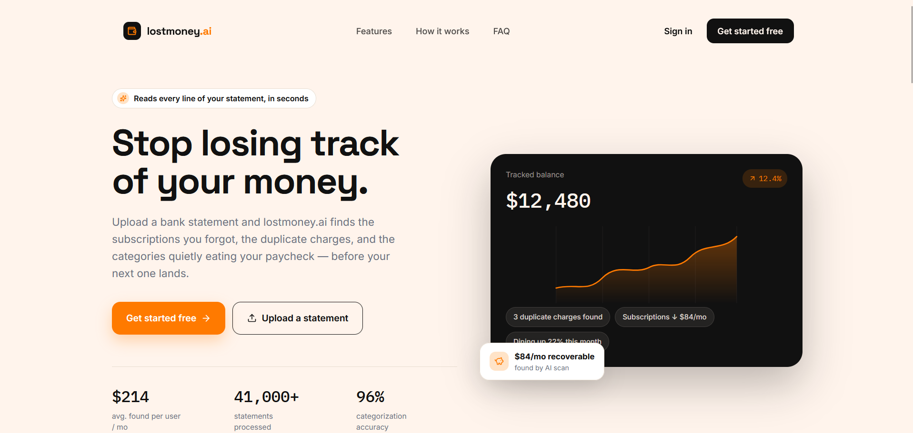
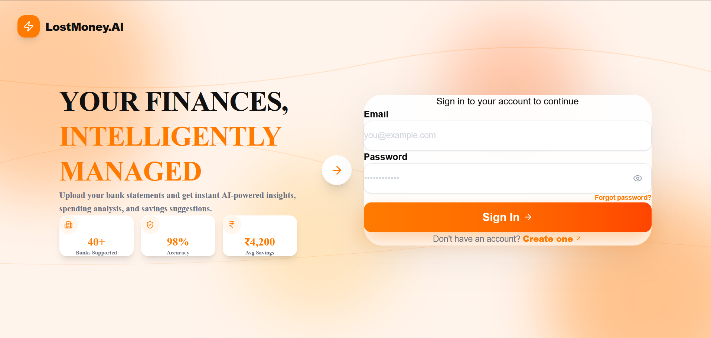
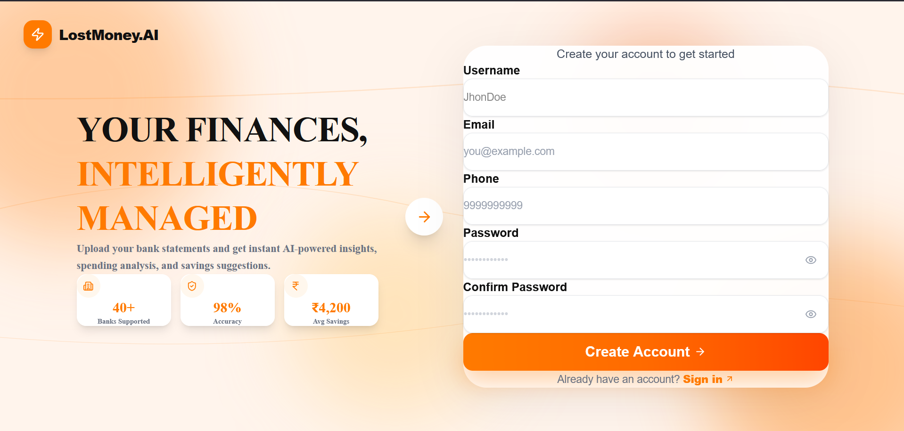
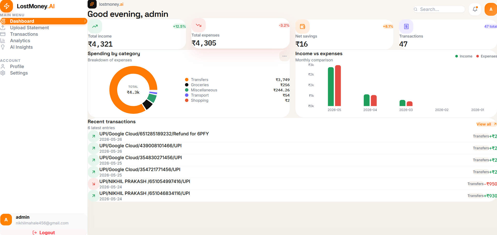
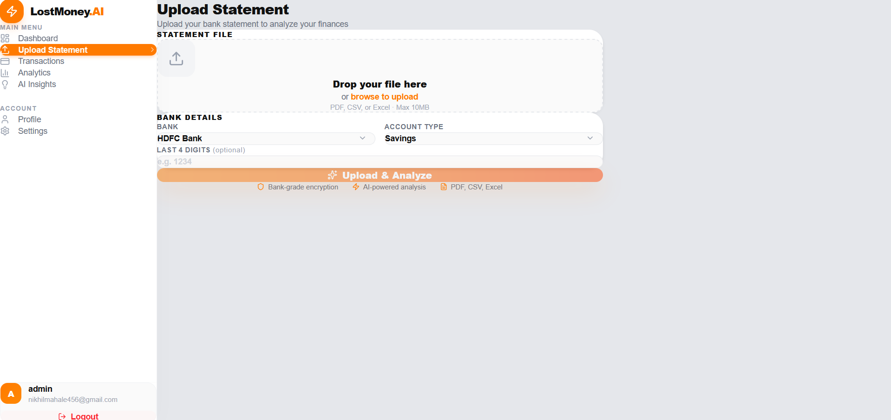
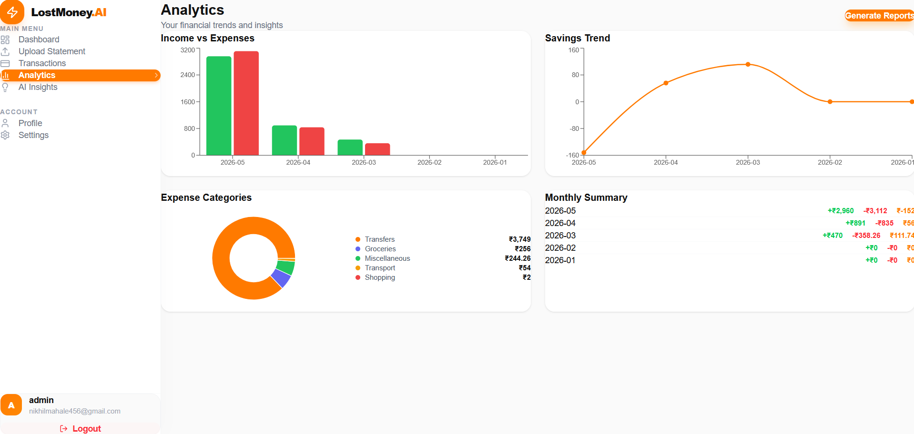
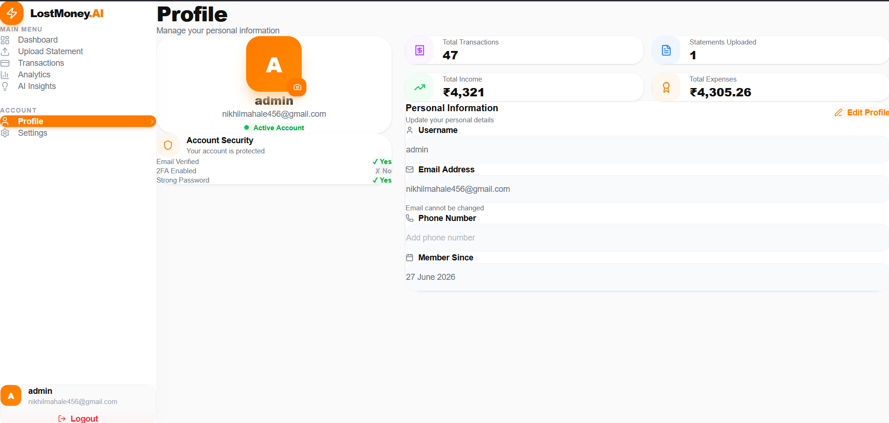
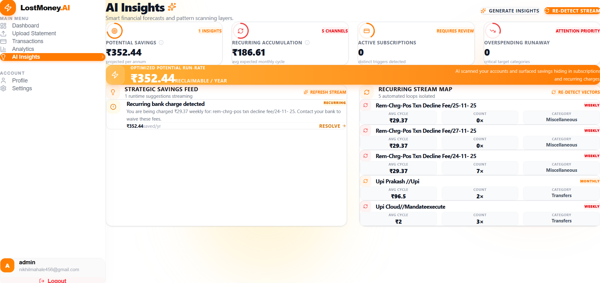

<div align="center">


# LostMoney.AI

### AI-powered personal finance tracker for India

Upload your bank statement → Get instant spending insights, recurring payment detection, and savings suggestions.

[](https://lostmoneyai.netlify.app)
[](https://YOUR-RAILWAY-BACKEND.up.railway.app)
[](LICENSE)

</div>

---

## Screenshots

---

# 📸 Screenshots

## Landing Page



---

## Sign In



---

## Register



---

## Dashboard



---

## Upload Statement



---

## Analytics



---

## Profile



---

## AI Insights



---


## What It Does

Most Indians have no idea where their money goes. LostMoney.AI solves this by letting you upload your bank statement (PDF, CSV, or Excel) and instantly getting:

- A categorized breakdown of every transaction
- Detection of forgotten subscriptions and recurring charges
- Monthly income vs expense comparison
- Personalized savings suggestions
- Interactive charts and analytics dashboard

---

## Features

| Feature | Description |
|---|---|
| JWT Authentication | Secure register, login, token refresh |
| Multi-format Upload | PDF, CSV, Excel — all major Indian banks |
| Background Processing | Celery + Redis async task queue |
| AI Categorization | ML-powered, 95%+ accuracy on Indian transactions |
| Recurring Detection | Finds forgotten subscriptions automatically |
| Monthly Reports | Income vs expense trends over time |
| Smart Suggestions | Tells you exactly what you can cut to save more |
| Search & Filter | Filter transactions by date, category, type |
| REST API | Fully documented Django REST Framework API |

---

## Tech Stack

### Frontend
- React + Vite
- Tailwind CSS
- Framer Motion
- Recharts
- Axios + React Router

### Backend
- Django + Django REST Framework
- PostgreSQL
- Celery + Redis
- JWT Authentication (simplejwt)

### Data Processing
- pdfplumber + camelot-py (PDF parsing)
- pandas + openpyxl (CSV/Excel)
- scikit-learn (transaction categorization)
- rapidfuzz (recurring payment detection)

### Deployment
- Frontend → Netlify
- Backend → Railway
- File Storage → Cloudinary

---

## Architecture

```text
React Frontend (Netlify)
        │
        ▼
Django REST API (Railway)
        │
 ┌──────┴────────┐
 ▼               ▼
PostgreSQL     Redis
                    │
                    ▼
             Celery Worker
                    │
                    ▼
     PDF Parsing Engine
   (pdfplumber + camelot)
                    │
                    ▼
 ML Categorization Engine
(scikit-learn + Rule Based)
                    │
                    ▼
     Analytics Dashboard
```

---

## Project Structure
```text
LostMoney-AI/
│
├── backend/
│   ├── apps/
│   │   ├── analytics/
│   │   ├── statements/
│   │   ├── transactions/
│   │   └── users/
│   │
│   ├── core/
│   ├── manage.py
│   └── requirements.txt
│
├── frontend/
│   ├── src/
│   │   ├── pages/
│   │   ├── components/
│   │   ├── context/
│   │   └── utils/
│   │
│   └── package.json
│
└── README.md
```

---

## ⚙️ How It Works

1. Upload bank statement (PDF / CSV / Excel)
2. Statement is securely stored on Cloudinary
3. Celery queues a background parsing task
4. pdfplumber & Camelot extract transactions
5. Transactions are categorized using rule-based + ML engine
6. Recurring subscriptions are detected
7. Analytics are generated
8. Dashboard updates instantly

---
## Author

**Nikhil Mahale**

[](https://github.com/nikhilhere7)
[](https://linkedin.com/in/nikhil-mahale-293987271)


---

<div align="center">
Built by Nikhil Mahale
</div>